# GM_talker

# GM_talker 项目介绍

GM_talker 是融合 GPT_SoVITS 及 Musetalker 的语音数字人综合项目项目，并加入了 deepseek 聊天机器人。本项目是方便大家快速完成自己的定制化数字人。

# 环境配置

本次介绍主要讲解在 autodl 的使用。不需要你有服务器也能快速实现自己的数字人，快来试试吧！

首先请登录 autodl[https://www.autodl.com/market/list](https://www.autodl.com/market/list)

## 2.1 设备选择

这里推荐北京 B 区的 4090 或者重庆 A 区的 4090D 单卡，可以满足语音和数字人任务设备需要。


## 2.2 镜像选择

点击社区镜像，选择 GM_talker 即可，因为还没上传完成暂时没有~


## 2.3 运行设备

配置好后再控制台点开机，再点击 jupyterlab 即可进入 terminal 页面。

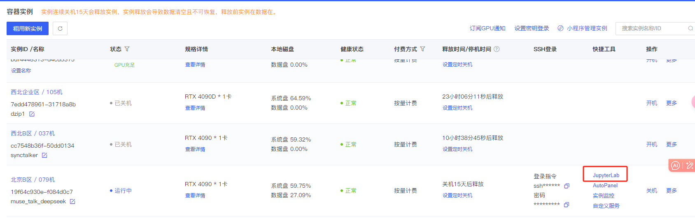

## 2.4 启动项目

找到：

/root/gm_talker/GPT_SoVITS/inference_webui.py文件后

在 888 行添加自己的 deepseek key

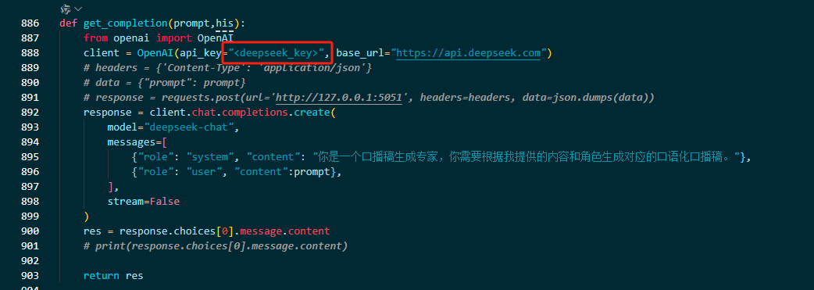

然后在 terminal 输入：

```python
mv ~/GPT-SoVITS/  ~/autodl-tmp
cd /root/autodl-tmp/GPT-SoVITS/
python "/root/autodl-tmp/GPT-SoVITS/GPT_SoVITS/inference_webui.py"
```

接着到控制台页面，点击自定义服务，映射端口（推荐在 vscode terminal 或者使用 autodl 工具启动命令）。

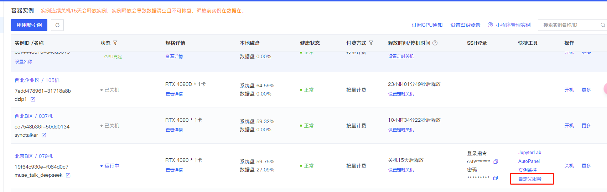

配置无误后可以通过  127.0.0.1:6006  进入项目。

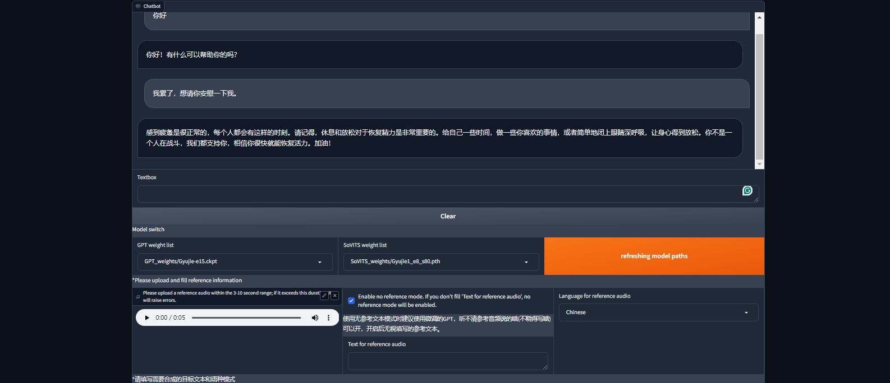

# 系统操作

## 3.1 界面介绍

- **chat 模块**

主要负责支持你需要的视频脚本编写，可以和 deepseek 智能体聊天生成你想要的文案。

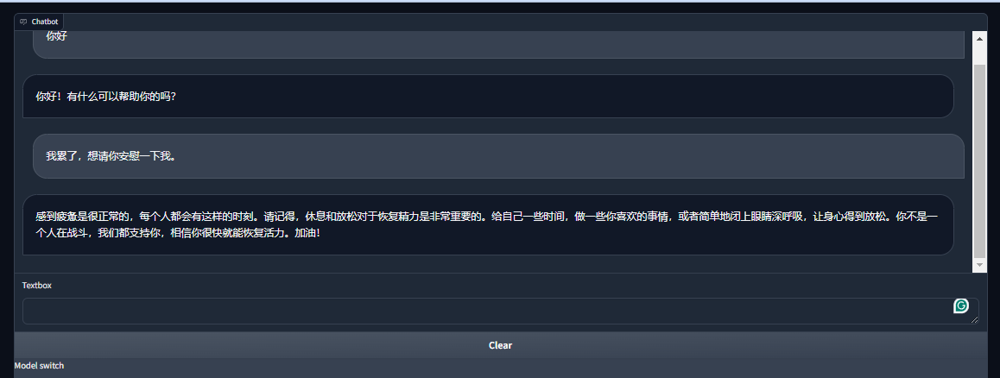

- **语音生成模块**

主要负责支持将语音转为个性化的文本，可以放入音频做参考微调。

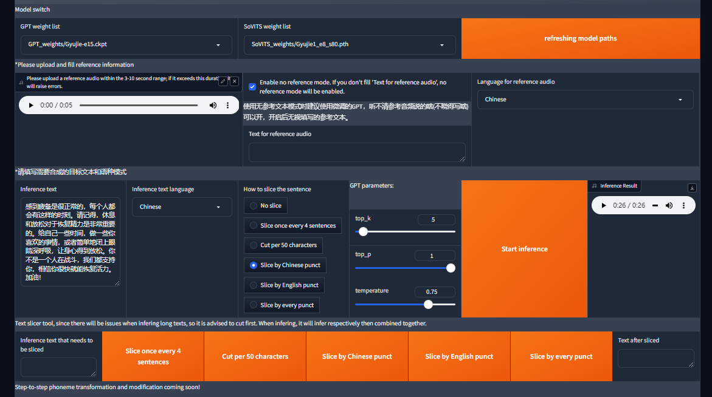

- **数字人生成模块及修复模块**

主要负责数字人的生成，以及生成后将画质修复。

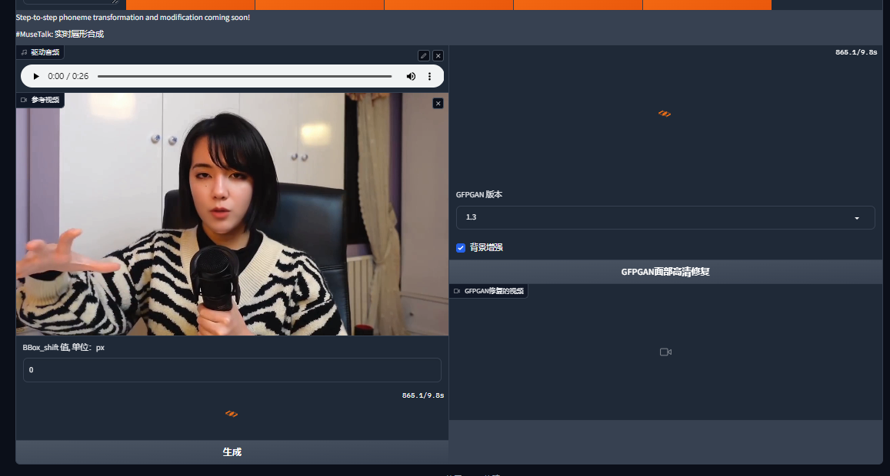

## 3.2 操作

### 3.2.1 chat 模块

chat 这里可以进行对话，输入即可得到需要的回答。你可以编写 prompt，和 deepseek 对话生成你的脚本。点击 clear 清除内容。

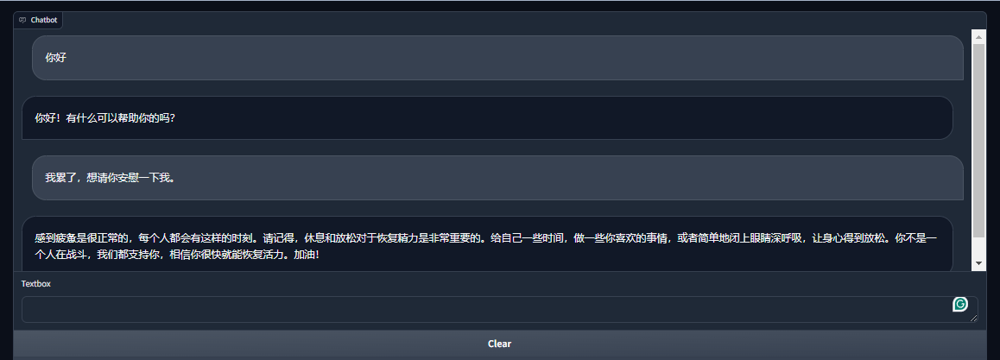

### 3.2.2 个性化语音生成模块

你需要准备一段音频作为参考声音，微调模型。或者使用我提供的模型做参考（御姐微调版本），输入你想生成的内容可以跑出你想要的结果。

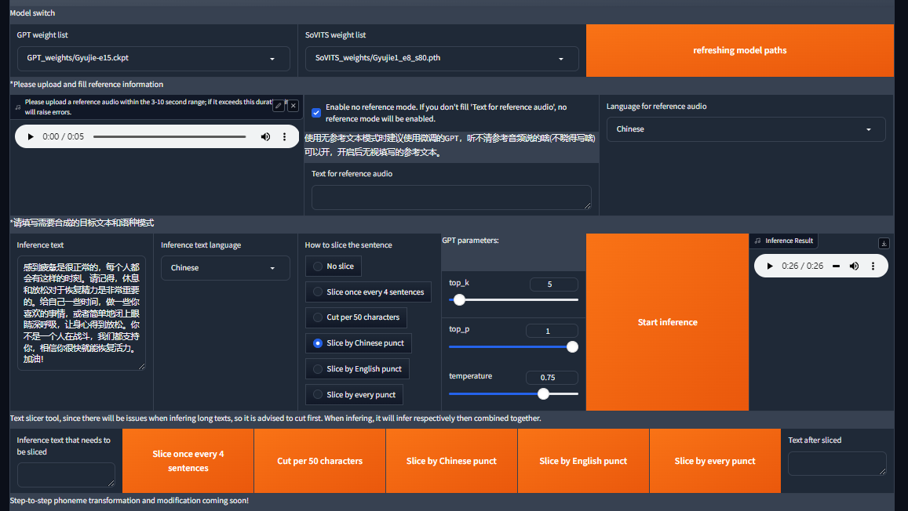

数据通过网盘获取，模型文件我也放在这里了，需要自取。

链接：[https://pan.quark.cn/s/216b643735ea](https://pan.quark.cn/s/216b643735ea)

这里的参考御姐及参考御姐 1 是指参考视频，放在下图圈出的位置。记得点击右侧的无文本模式，否则音频效果会不好。

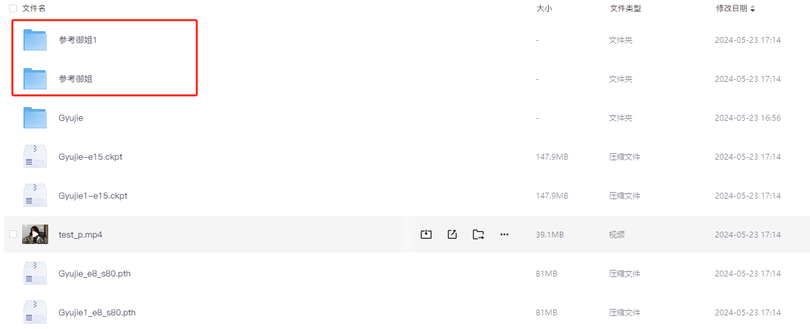

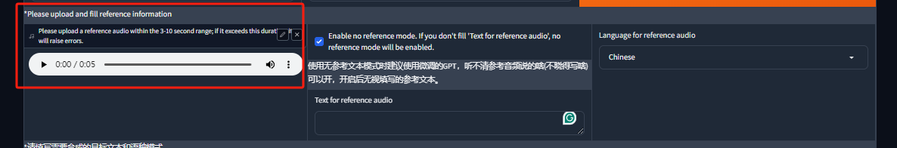

接下来说说推理。

- 首先请将 chat 得到的内容放进去，就是你要生成音频的文本。
- 然后请选择与文本匹配的语言规则。
- 接着是切分规则，一般选择以中文句号分割。
- GPT parameters 可以保持默认，然后点推理即可。
- 然后请大家讲推理好的音频试听一下，没问题就请下载。

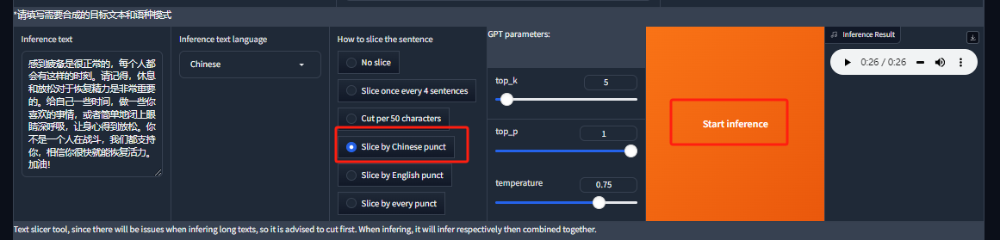

注意：下面批量生成可以忽略~

### 3.2.3 视频生成

首先你需要准备一个参考视频，我在刚才的网盘里提供了一份视频，大家也可以自己上传。

这个视频不要动作幅度过大，尽量保持闭口，背景不要过于复杂。

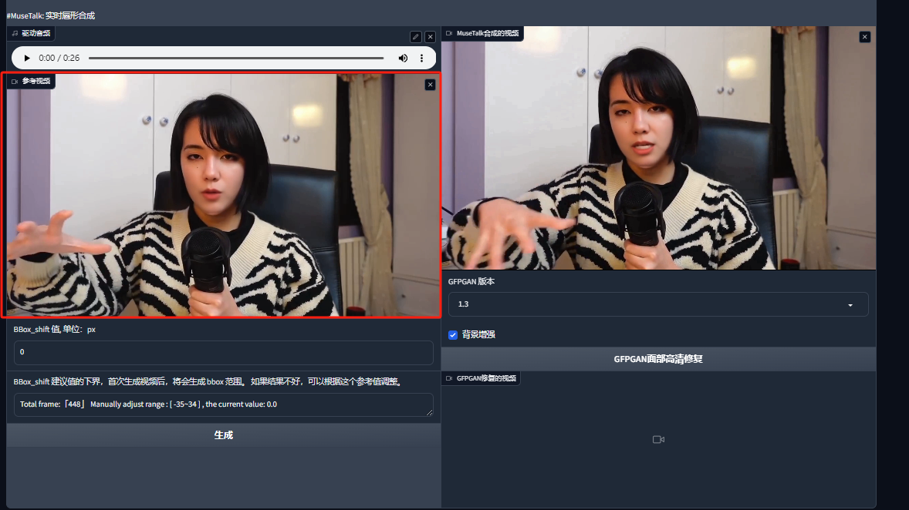

然后记得把你生成的音频也送进去。

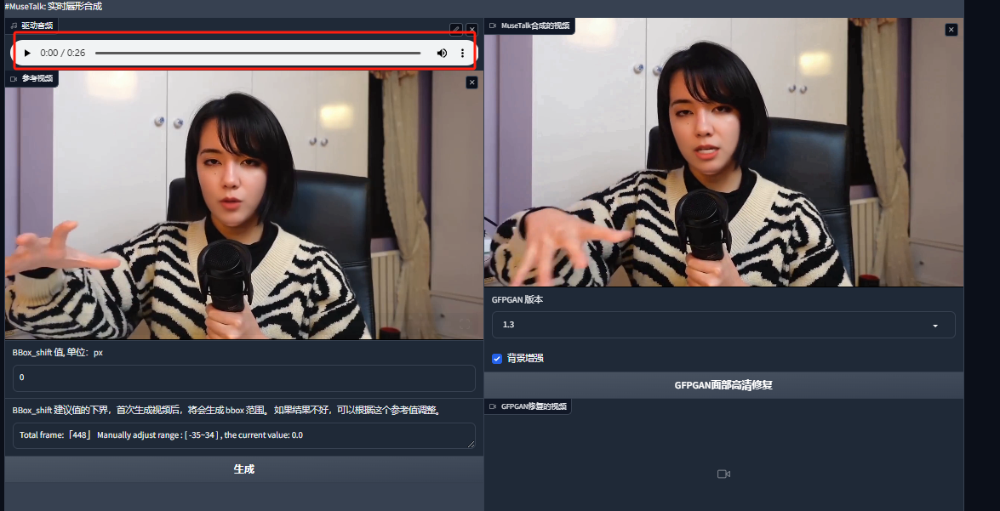

点一下生成即可~（算法暂未调整速度较慢。）结果会在右侧标出的位置显示，安静等待即可。

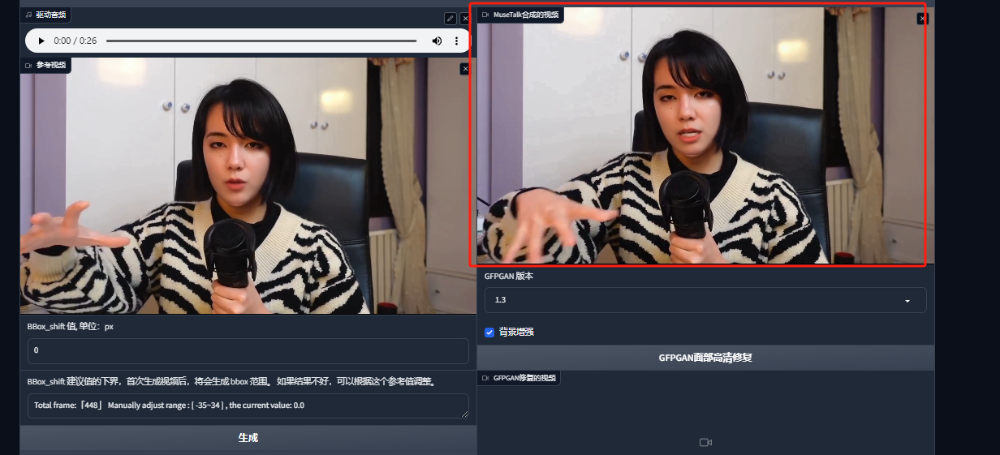

如果有面部修复需求点击下面的修复，很慢！

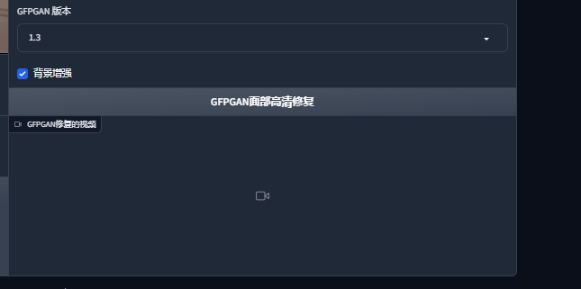

## 3.3 效果展示
# 4.引用
https://github.com/RVC-Boss/GPT-SoVITS
https://github.com/deepseek-ai/DeepSeek-LLM
https://github.com/TMElyralab/MuseTalk
